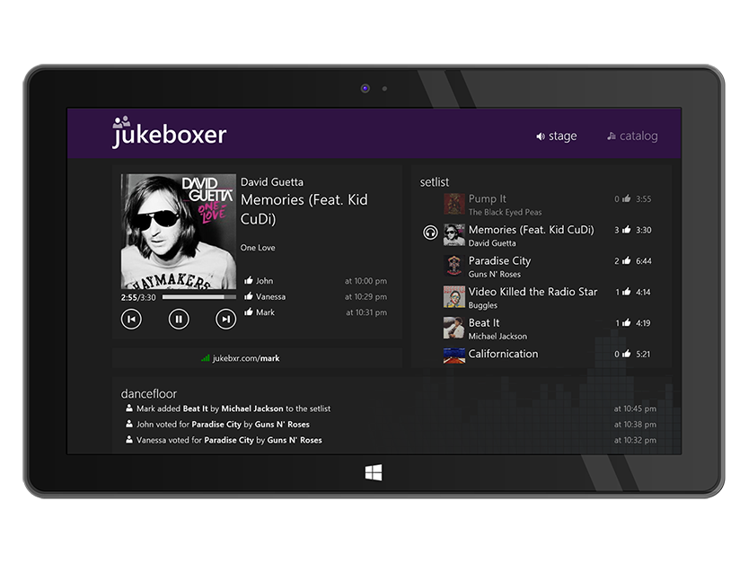
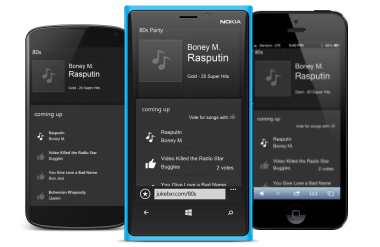

# Jukeboxer

Jukeboxer was a social music player enabling party hosts to share control of their playlist with friends.

The app was released in 2013 and available up until 2015.

   

   

## Components

##### Phone app
* On-device song catalog parsing
* Playlist management / music player
* Remote playlist control by web app(s) via realtime connection (playlist reordering, activity tracker)

#### Web app
* Add songs to playlist from host song catalog
* Upvote songs in playlist to skip the queue
* View currently playing song

##### Cloud app
* Realtime channel management for party hosts & participants, playlist updates

## Reviews

[Windows 8 Social Music Player Free: Jukeboxer](https://www.ilovefreesoftware.com/07/windows8/windows-8-social-music-player-free-jukeboxer.html)
